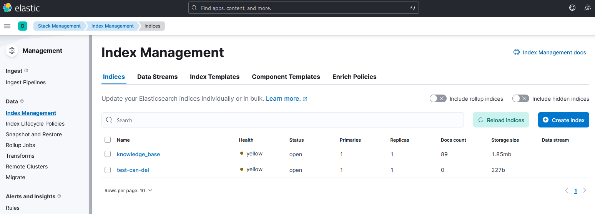
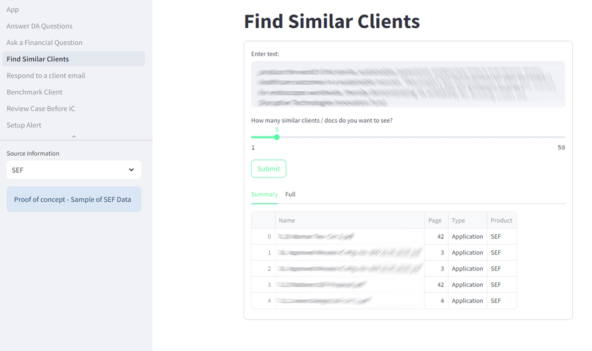

# Project Usage Notes
An AI Knowledgebase implementation using RAG (Retrieval Augmented Generation). Focuses on answering internal corporate queries (i.e. managing sensitive data, but also leveraging on a human-in-the-loop to both filter answers and provide feedback to learn) 

## Three main parts to the application: 
While they are linked, you will typically run only one 
1. Ingest - scripts to load information (e.g. pdf or email) into the KnowledgeBase (Elastic)
1. Bot - scipts to answer questions passed to it (to /from Excel) using RAG techniques
1. App - UI to answer questions in a back and forward way, focussing on 4 key business use cases.

## Underlying technologies:
* Choice of Large Language Model (LLM) - either local or Microsoft Copilot.
* Elastic Search as the Vector search engine, but also "Human Friendly" UI for colleagues to fine-tune the retrieval search results.
* Langchain to integrate the above steps, but also allow for further extensions (choice of more LLMs, more document indexing, varying of steps in the response chain).
* Python scripts to implement
* (Optional) Streamlit for a user friendly UI 
* (Optional) Read / Writes files to Excel 365 - allows for integration with wider Office 365 and Power Automate workflows.

## Setup

Instructions for first time setup of the project:
1. Checkout / download this project as a folder onto the host computer

1. Install Docker - standard install (either Docker Desktop, or via WSL-Ubuntu).You may also need to install the docker-compose plugin 

1. Install Python (3.12 or higher) in the usual way. Python pip and virtualenv tools are also needed.

1. Install Python dependencies - in a terminal window, at the project root
    * Create environment: _virtualenv venv_
    * Activate environment: _source venv/bin/activate_
    * Install Python dependencies for this environment: _pip install -r requirements.txt_

1. Setup index in Elastic (first time only):
    * Start Elastic (using docker compose up - see notes below):
    * Open Kibana (see notes below)
    * Setup indices - open this page  http://localhost:5601/app/management/data/index_management/indices
        * _test-can-del_ - used by unit tests
        * _knowledge_base_ - the main index used to store documents

It is possible to install Elastic and Kibana directly on the machine (i.e. no Docker needed), please refer to the Elastic / Kibana home page for instructions - https://www.elastic.co/

## Starting the background infrastructure

A Docker compose file is provided to make it easy to download and run the supporting infrastture (e.g. the Elastic Search engine). To start this Infrastructure using Docker:
* Open terminal window, navigate to home folder containing docker-compose.yml
* Start Elastic and Kibana using: _docker compose up_

You can check if the Elastic Search Service is running using the url http://localhost:9200/. You should see a success message similar to the screenshot below.

The Kibana App runs on top of Elastic and allows you to create indexs to store and search data. It is also useful in fine-tuning the searches so that we can pass more relevant documents as a prompt to the large language model.

Kibana (Elastic Search Management tool) available on http://localhost:5601  - useful in managing the different "buckets" within the knowledgestore. ## admin and tweaking) ### this is useful for fine-tuning the search / similar documents being fed to the LLM.

 

No screenshot, but also automatically started is the Portainer Web Management for Docker, available at https://localhost:9443 . This can safely be commented out in the docker-compose file if this is not needed.

## Running the Ingest Script 

Before using a Knowledgebase you obviously need to import knowledge into it. 
* The main script to ingest data is in the _app/ingest.py_ . 
* This script will take a starting folder and index most of the files (pdf, messages , word docs) found in that folder. It will also find sub-folders and index those recursivly.

To run the ingest script
* Open the app folder: _cd app_ in a terminal window
* Activate the Python environment with dependencies you installed earelier: _source venv/bin/activate_
* Run the script using _python ingest.py_

In general, you will only need the ingest script once (or infrequently, if you wise to add more documents). For small datasets, it is probably easier to delete the Knoweldbase index (using Kibana - see link and screenshot above), then run the Ingest script again.

### Config
* The starting folder (and other values) are set in _app/config/config.conf_ - please edit this or see the notes in the _app/config_ folder to customize configuration. This config file is shared for the ingest script, the Bot and the Application.

# Running the Application and Bot

The application is a UI, easier to use. The Bot is semi-automatic and does many of the same things, but as part of a process flow

## Running the Bot

Typical flow for the Bot is to read a question from Excel, apply RAG techniques to answer the question, then save the answer back in Excel. Since the Excel file can be hosted online, this allows Intregation with Office 365 and Power Automate. e.g.
1. The User can ask a question on Microsoft Forms
1. Power Automate saves this question in Excel.
1. The Bot reads the question, saves the answer back in Excel.
1. Human can review the answer, update the line in Excel if they are happy with it.
1. Power Automate can send back the answer.

To run the bot.
* Open the app folder: _cd app_ in a terminal window
* Activate the Python environment with dependencies you installed earelier: _source venv/bin/activate_
* Run the script using _python bot.py_

## Run the Web Application
The Web application addresses a wider range of business use cases than the bot - see the tabs on the left hand side of the screenshot below.

To run the Web Application.
* Open the app folder: _cd app_ in a terminal window
* Activate the Python environment with dependencies you installed earelier: _source venv/bin/activate_
* Run Streamlit app to interact with documents local llm: _streamlit run app.py_
* App available on http://localhost:8501 

# Development notes

## Folders 
* High level folders
    * _data-sample_ - sample public documents to get you started with the scripts (e.g. Ingest then ask questions against)
* Main application is in the _app_ folder    
    * _app/cache_ [local only] - local only backup of information
    * _data_no_share_ [local only] - some of the scripts may look to load information from here
    * _app/pages_ - sub pages in the webapp
    * _app/settings_ - configuration files
    * _app/templates_ template files for prompts and emails
    * _app/tests_ - unit tests for the application
    * _app/unil_ - supporting scripts to implement data extraction, indexing to elastic, language process, reading-writing office files, implemeting RAG. More notes on these in the sub folders.

* new folders settings, data sample and output sample ####

## Running Unit Tests
To run the Unit tests
* Open the app folder: _cd app_ in a terminal window
* Activate the Python environment with dependencies you installed earelier: _source venv/bin/activate_
* Choose which type of test you want to run
        * single test: _python3 -m unittest tests.index_elastic_test_
        * all tests: _python3 -m unittest tests_

## Background reading and more information

The application draws on many concepts and articles - for example
* Original source notebook, RAG on Star Wars: 
    * https://colab.research.google.com/drive/11N01ssHqAXjW5NKJYkwT06V7RXLG4Yin#scrollTo=Sax1r_wW8kec
    * https://colab.research.google.com/github/elastic/blog-langchain-elasticsearch/blob/main/Notebooks/Privacy_first_AI_search_using_LangChain_and_Elasticsearch.ipynb?utm_source=pocket_saves

Background information and links when developing this project
* Elastic search blog article : https://www.elastic.co/search-labs/blog/articles/privacy-first-ai-search-langchain-elasticsearch
* More info (On Langchain) https://python.langchain.com/docs/integrations/vectorstores/elasticsearch
* https://www.elastic.co/blog/getting-started-with-the-elastic-stack-and-docker-compose (Part 1 of 2)
* Setup Elasticsearch UI -https://docs.elastic.co/search-ui/tutorials/elasticsearch
* Kibana API requests - https://www.elastic.co/guide/en/kibana/current/console-kibana.html
* Elastic Search Getting started - https://www.elastic.co/guide/en/workplace-search/8.7/workplace-search-getting-started.html
* Search UI with elastic search - 	• https://docs.elastic.co/search-ui/tutorials/elasticsearch

